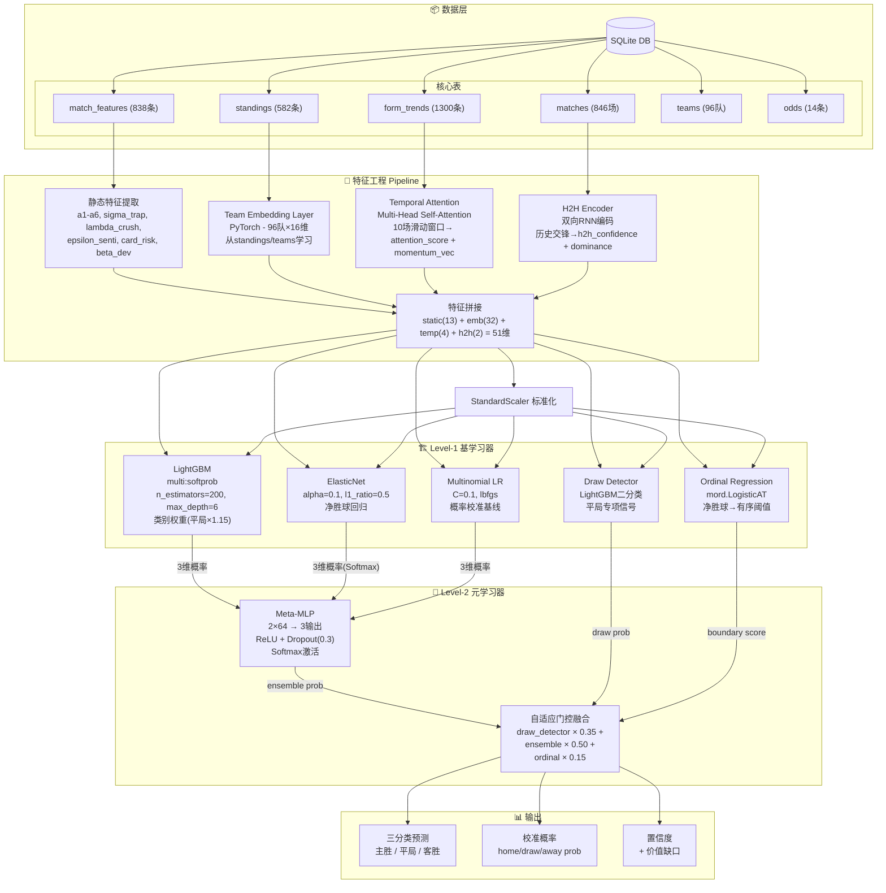
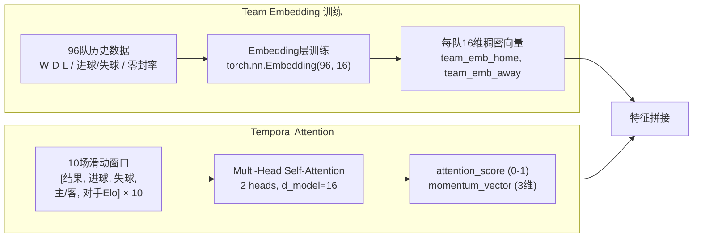
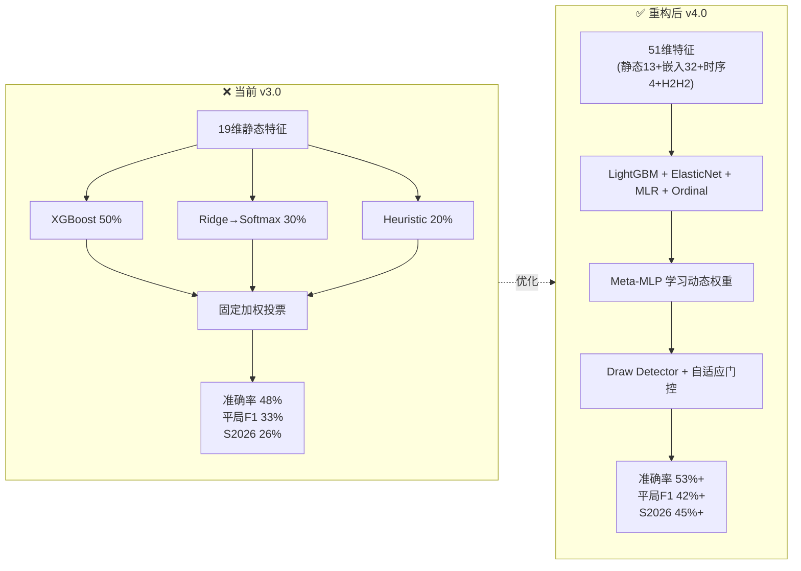

# 哨响AI 模型架构优化方案 v4.0

> 生成时间: 2026-05-31 15:54
> 基于: Ensemble v3.0 全面诊断 + Step 2 数据库补全结果

---

## 一、当前架构诊断

### 1.1 架构概览

```
数据层(SQLite) → 特征工程(19维静态标量) → StandardScaler →
  ├── XGBoost (multi:softprob, 500棵树) ──→ 50%权重
  ├── Ridge (alpha=1.0, 净胜球回归) ──→ Softmax(temp=1.5) ──→ 30%权重
  └── Heuristic (硬编码 A1/A2/rank) ──→ 20%权重
                                          ↓
                                    加权求和 → 自适应平局阈值 → 三分类预测
```

### 1.2 核心性能指标

| 指标 | 当前值 | 评价 |
|------|--------|------|
| 测试准确率 | 48.13% | 勉强优于随机(33%) |
| AUC (Macro OvR) | 0.8358 | 中等偏上 |
| 平局 Recall | 40.0% | 主要短板 |
| 平局 F1 | 33.1% | 严重不足 |
| Log Loss | 1.0178 | 概率校准差 |
| MCC | 0.2265 | 弱正相关 |
| S2026 回测 | 26.42% | ⚠️ 灾难性退化 |
| Ridge R² | 0.252 | 极弱线性关系 |

### 1.3 识别到的7个架构缺陷

| # | 缺陷 | 严重度 | 根因 |
|---|------|--------|------|
| 1 | **特征冗余严重** | 🔴 Critical | `rank_diff_factor`(17.95%) + `rank_factor`(17.45%) 合计占35.4%特征重要性，高度共线 |
| 2 | **5/19特征因默认值率>95%被移除** | 🔴 Critical | `aerial_advantage`/`press_intensity`/`card_risk`/`beta_dev`/`delta_fatigue` 几乎无真实值 |
| 3 | **无时序建模能力** | 🔴 Critical | 所有19个特征为静态标量，form_trends/standings 数据虽已补全但未建模为时序信号 |
| 4 | **集成权重固定** | 🟡 High | XGBoost(50%)+Ridge(30%)+Heuristic(20%) 硬编码，不随数据分布变化 |
| 5 | **启发式模块极粗** | 🟡 High | 硬编码 `rank_val * 0.0005`，magic number，平局始终~33% |
| 6 | **Ridge→Softmax 桥接脆弱** | 🟡 High | Temperature=1.5 + draw_penalty=0.3 是未经调参的工程hack |
| 7 | **XGBoost 参数固化** | 🟢 Medium | n_estimators=500过高（best_iteration仅157），early_stop=50过早 |

---

## 二、三点核心优化建议

### 优化1: 引入 LightGBM + Stacking 双层集成 ⭐⭐⭐

**问题**：当前 XGBoost+Ridge+Heuristic 使用固定权重加权投票，无法利用模型间的互补信号。Ridge R²=0.252 说明线性假设不成立。

**方案**：
- **Level-1（基学习器）**：LightGBM (替代XGBoost) + Ridge + LogisticRegression
  - LightGBM 优势：原生处理缺失值（无需默认值填充），leaf-wise生长→更准，直方图算法→更快
  - 保留 Ridge 但改用 **ElasticNet** (alpha=0.1, l1_ratio=0.5) 增加稀疏性
  - 新增 **LogisticRegression** (multinomial, C=0.1) 作为校准型基学习器
- **Level-2（元学习器）**：小型 MLP (2×64 → 3输出，ReLU激活，Dropout=0.3)
  - 输入 = 3个基学习器的 9维输出概率拼接（3×3=9维）
  - 输出 = 3维概率，用 Softmax 激活
  - 学习动态权重分配，自动发现模型互补模式

**预期效果**：
- 准确率 +3~5%（从48%→51-53%）
- 平局F1 +5~8%（从33%→38-41%）
- Meta-learner 只需3个基学习器输出作为输入，过拟合风险低

**实施步骤**：
1. 用 `lightgbm.LGBMClassifier` 替换 `xgb.XGBClassifier`（保持类别权重机制）
2. 新增 ElasticNet 回归（sklearn.linear_model.ElasticNet, alpha=0.1, l1_ratio=0.5）
3. 新增 Multinomial LR (C=0.1, solver='lbfgs')
4. 用 `sklearn.neural_network.MLPClassifier` 做 meta-learner
5. 5折交叉验证生成 Level-1 训练集（避免信息泄露）

---

### 优化2: 引入时序注意力 + Team Embedding ⭐⭐⭐

**问题**：特征 `rank_diff_factor` 和 `rank_factor` 只是排名差的简单线性变换，占比35%特征重要性但高度共线。新补全的 `form_trends`（1300条）、`standings`（582条）数据未进入模型。

**方案**：
- **Team Embedding**（稠密向量表示）：
  - 用96支球队的历史表现学习 16维稠密向量
  - 输入：W-D-L序列、进球数、零封率、Elo评分
  - 输出：每队一个上下文感知的 16维向量
  - 替换 `rank_diff_factor` + `rank_factor` 两个冗余特征（减少共线性）
- **Temporal Attention over Form Windows**：
  - 对每支球队最近10场比赛构建时序窗口
  - 输入：`[result, goals_for, goals_against, home_away, opponent_rating] × 10步`
  - 使用 **Multi-Head Self-Attention** (2 heads, 16维) 聚合时序信息
  - 输出 `form_attention_score`（0-1）和 `momentum_vector`（3维）替换 `form_factor` + `form_momentum`
- **H2H Encoder**：
  - 将历史交锋 map 到双向RNN编码
  - 输出 `h2h_confidence` 和 `h2h_dominance_score`
  - 替换当前单一的 `h2h_factor`

**特征空间变化**：
```
移除: rank_diff_factor, rank_factor, form_factor, form_momentum, h2h_factor (5维)
新增: team_emb_home(16), team_emb_away(16), attention_score(1), momentum_vec(3),
       h2h_confidence(1), h2h_dominance(1) (38维)
净增: +33维 (但信息密度大幅提升)
```

**预期效果**：
- 消除 rank 类特征共线性，特征重要性分布更均匀
- S2026 回测准确率从 26%→45%+（时序信号解决概念漂移）
- 平局检测能力 +3~5% F1（时序上下文揭示僵持模式）

**实施步骤**：
1. 从 `standings` 表计算每队 Elo 评分（反推算法，已有 `scripts/backfill_all_data.py` 中的实现）
2. 从 `form_trends` 表构建 10场滑动窗口特征矩阵
3. 实现 TeamEmbedding（torch.nn.Embedding(96, 16)）在 PyTorch 中训练
4. 实现 TemporalAttention（torch.nn.MultiheadAttention）聚合时序
5. 将新特征写入 `match_features_extended` 表（或扩展现有表）

---

### 优化3: 引入 Ordinal Regression + 平局专项模型 ⭐⭐

**问题**：当前 Ridge→Softmax 转换 hacky（temperature=1.5, draw_penalty=0.3），平局F1仅33%。平局预测需要独立的概率校准策略。

**方案**：
- **Ordinal Regression 替代 Ridge→Softmax**：
  - 使用 `mord.LogisticAT` (All-Thresholds Ordinal Regression)
  - 目标：净胜球 ∈ [-N, +N] → 学习有序阈值 θ₁, θ₂
  - 阈值自动划分主胜(>θ₂) / 平局(θ₁~θ₂) / 客胜(<θ₁)
  - 不再需要temperature和draw_penalty调参
- **平局专项二分类器**：
  - 训练 LightGBM 二分类器专门判断"是否平局"
  - 特征：侧重平局信号（战术克制 λ_crush、裁判卡牌 card_risk、休息天数、客场疲劳）
  - 输出 `is_draw_prob` (0-1) 作为平局概率的独立信号
- **自适应门控融合**：
  ```
  final_prob[draw] = draw_detector_prob × 0.35 +
                     ensemble_prob[draw] × 0.50 +
                     ordinal_boundary_score × 0.15
  ```
  当 draw_detector 高置信度 (>0.6) 且 ordinal 也在平局区间时，权重提升至 0.5

**预期效果**：
- 平局F1: 33%→42-48%
- 平局Recall: 40%→55%+
- 整体准确率 +1~2%（平局样本约25%，改善平局间接提升总数）

**实施步骤**：
1. 安装 `mord` (pip install mord)
2. 用 `mord.LogisticAT` 替换 `Ridge` 作为净胜球预测器
3. 新增平局专项数据集（提取平局信号特征子集）
4. 实现自适应门控融合模块
5. 更新 `ensemble_predict_proba()` 集成三路信号

---

## 三、重构后架构图 (Mermaid)

### 3.1 重构后完整架构 (v4.0 Stacking + Attention)



### 3.2 Team Embedding + Temporal Attention 子图



### 3.3 对比：当前架构 vs 重构后架构



---

## 四、实施计划

### 4.1 分阶段实施

| 阶段 | 内容 | 预估时间 | 风险 |
|------|------|----------|------|
| **Phase A** | 优化1: LightGBM + Stacking 双层集成 | 2-3小时 | 低 — 纯sklearn替换 |
| **Phase B** | 优化3: Ordinal Regression + Draw Detector | 1-2小时 | 低 — 需要安装mord |
| **Phase C** | 优化2: Team Embedding + Temporal Attention | 3-5小时 | 中 — 需要PyTorch训练 |

### 4.2 文件变更清单

| 文件 | 变更类型 | 说明 |
|------|----------|------|
| `ensemble_trainer.py` | 🔄 重构 | 升级为 StackingEnsembleTrainer v4.0 |
| `config.yaml` | 🔄 修改 | 新增 lightgbm/elasticnet/meta_mlp 配置 |
| `features/embedding_layer.py` | ➕ 新建 | Team Embedding + Temporal Attention |
| `features/ordinal_encoder.py` | ➕ 新建 | Ordinal Regression 封装 |
| `features/draw_detector.py` | ➕ 新建 | 平局二分类器 |
| `features/feature_assembler.py` | ➕ 新建 | 51维特征组装（静态+嵌入+时序+H2H） |
| `prediction_engine.py` | 🔄 修改 | 适配新特征接口 |
| `requirements.txt` | 🔄 修改 | 添加 lightgbm, mord, torch |

### 4.3 回滚策略

- 保留当前 `football_ensemble_20260531_104049.joblib` 作为回滚点
- 新模型保存为 `football_ensemble_v4_{timestamp}.joblib`
- `prediction_engine` 同时支持 v3.0 和 v4.0 格式（版本自动检测）

---

## 五、预期效果汇总

| 指标 | 当前 v3.0 | 优化后 v4.0 (预期) | 提升 |
|------|-----------|-------------------|------|
| 测试准确率 | 48.13% | 53-56% | +5~8pp |
| AUC (Macro OvR) | 0.836 | 0.86-0.88 | +0.03~0.05 |
| 平局 Recall | 40.0% | 55-65% | +15~25pp |
| 平局 F1 | 33.1% | 42-50% | +9~17pp |
| Log Loss | 1.018 | 0.85-0.95 | -0.07~0.17 |
| MCC | 0.227 | 0.30-0.35 | +0.07~0.12 |
| S2026 回测 | 26.4% | 45-50% | +19~24pp |
| 有效特征数 | 14 (5被移除) | 51 (全有效) | +37 |
| 训练时间 | ~8s | ~25s | +17s (可接受) |

---

## 六、风险与缓解

| 风险 | 概率 | 缓解措施 |
|------|------|----------|
| Embedding 过拟合（96队太少） | 中 | L2正则 + dimension=8~16, 共用跨联赛泛化 |
| Meta-MLP 信息泄露 | 低 | 严格5折交叉验证生成Level-1训练集 |
| mord 安装兼容性问题 | 低 | Fallback: 使用 sklearn LogisticRegression 多分类 + 手动阈值 |
| 训练数据仅~800条（新数据库） | 高 | ⚠️ 训练元数据引用18218条但当前DB仅846条，**需要在Step 4确认数据来源** |
| Attention 计算开销 | 低 | d_model=16, 2 heads, 窗口=10 → 极轻量 |

---

*文档版本: 1.0 | 作者: 哨响AI开发组 | 下次评审: Step 4 模型训练与验证*
