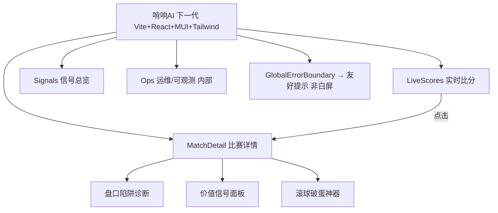
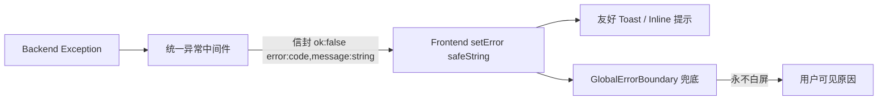

# 哨响AI 稳定化下一代足球系统 — 简单 PRD

> 文档类型：简单 PRD（Simple PRD）
> 作者：许清楚（Xu，产品经理）
> 适用对象：架构师 / 后端 / 前端 / 运维
> 版本：v0.1（待架构评审）

---

## 0. 项目信息（速读）

- **项目定位**：在现有哨响AI能力上做"稳定化下一代"重构，复用盘口 SSoT、ML 模型资产、数据资产（football_data.db / GQ.db / shaoxiang_feature_library.db），**非完全推倒重来**。
- **默认技术栈**：前端 Vite + React + MUI + Tailwind；后端 FastAPI + 结构化日志 + 异步任务队列；数据库仍用 SQLite（单机私有部署），但须根治坏页/锁问题。
- **核心诉求**：不是堆功能，而是把 7 类已知"不稳定"事故在架构层面根治，同时保留赔率破解核心能力。
- **原始需求复述**：把 bridge 冻结、GQ 坏页、前端白屏、采集器非 ASCII 崩轮、低水规则自相矛盾、滚球时间窗口 bug、双源 ROI 偏差 这 7 类事故，转化为架构级稳定性需求，产出一套稳定、可观测、零意外白屏的下一代系统。

---

## 1. 产品目标

**一句话目标**：在复用现有赔率破解核心资产的前提下，通过架构层根治 7 类已知不稳定事故，把哨响AI从"偶发崩盘"重构为"可观测、可自愈、零意外白屏"的稳定生产系统。

**3 条核心指标（北极星 + 可用性 / 性能 / 质量）**：

| 指标 | 目标 | 对应事故 |
|---|---|---|
| 采集可用性 | ≥ 99.9%（月度），单轮崩溃（非 ASCII / 锁）归零 | 1,2,4 |
| API 延迟与存活 | API P99 < 1s，且 `/health` 永不超时（始终 200） | 1 |
| 质量红线 | 零因非 ASCII 日志崩轮 + 零前端白屏（React 抛错率 = 0） | 3,4 |

---

## 2. 用户故事

### A. 操盘手（Trader / 价值信号使用者）
- **US-T1**：作为操盘手，我希望在 LiveScores 页实时看到"刚开赛"的比赛不漏显，以便不错过滚球破蛋窗口。
- **US-T2**：作为操盘手，我希望盘口陷阱诊断在给出"低水线是价值还是诱多"判定时附上开盘价依据，以免看到自相矛盾的信号打脸。
- **US-T3**：作为操盘手，我希望价值信号面板按 ROI 真实归因排序（排除采样偏差假阳性），以便优先打高确定性单。
- **US-T4**：作为操盘手，我希望滚球破蛋神器的时间窗口 / λ 口径 / 方向逻辑一致且可解释，以便信任并据此下注。
- **US-T5**：作为操盘手，我希望跨庄软线价差信号标注数据来源与置信度，以便在双源分歧时知道该信哪一源。

### B. 运维（DevOps / 稳定性负责人）
- **US-O1**：作为运维，我希望 bridge_service 事件循环永不冻结，`/health` 端点始终 200，以便快速判断系统存活。
- **US-O2**：作为运维，我希望采集器单轮异常被隔离（不崩整轮、不跳过关键步骤），以便 scheduled 任务稳定翻 live。
- **US-O3**：作为运维，我希望 SQLite 连接不再抢写锁 / 不再坏页，GQ.db（~7GB）高频写入稳定，以便数据资产不损坏。
- **US-O4**：作为运维，我希望结构化日志（JSON、UTF-8）统一输出且可检索，以便事故快速定位。
- **US-O5**：作为运维，我希望脏数据（unified_history.db 7360 行、双源 ROI 偏差）有清洗与校验护栏，以便模型训练不被污染。

### C. 前端用户（查看比分 / 信号的普通用户）
- **US-F1**：作为前端用户，我希望任何后端错误都以友好提示呈现而非白屏，以便始终知道发生了什么。
- **US-F2**：作为前端用户，我希望 LiveScores 加载有骨架屏 / 错误边界兜底，以便弱网或部分接口失败时仍可浏览其他板块。
- **US-F3**：作为前端用户，我希望盘口与信号页响应流畅（P99 < 1s），以便决策不被卡顿打断。
- **US-F4**：作为前端用户，我希望"刚开赛"比赛在前端有清晰 live 标识，以便识别实时进行中的场次。

---

## 3. 需求池

**优先级定义**：
- **P0 = 必须**：根治事故根因，缺失不可上线。
- **P1 = 应当**：显著稳定性 / 可用性提升。
- **P2 = 可选**：体验 / 可观测增强。

**事故映射**：每条需求标注对应要根治的事故编号（1=bridge冻结 / 2=GQ坏页 / 3=前端白屏 / 4=非ASCII崩轮 / 5=低水自相矛盾 / 6=滚球时间窗口 / 7=双源ROI偏差）。

### P0 — 必做（根治事故根因）

| 编号 | 描述 | 验收标准 | 事故 |
|---|---|---|---|
| **REQ-01** | **bridge_service 事件循环防冻结**：将阻塞 / 同步调用移出事件循环；引入心跳与超时熔断；`/health` 独立于主业务路径 | 10× 负载压测下 `/health` 持续 200 且 P99 < 1s；CLOSE_WAIT 不累积；全站超时归零 | 1 |
| **REQ-02** | **GQ.db 连接治理**：移除每次连接执行的持久化 PRAGMA 抢写锁；连接池化 + WAL 模式 + 单写者；坏页自检与自动备份 | ~7GB GQ.db 高频并发写入 24h 无 `database locked`；启动坏页自检告警；月度零坏页 | 2 |
| **REQ-03** | **后端错误标准化**：所有异常统一序列化为信封 `{ok:false, error:{code, message}}`，`message` 必为**字符串**（非对象 / 非嵌套） | 后端单测覆盖所有异常分支；`message` 字段类型强约束为 string；错误响应 schema 固定 | 3 |
| **REQ-04** | **前端错误安全消费**：`setError` 仅接收并渲染安全字符串；全局 `ErrorBoundary` + 友好提示组件，禁止把对象塞入 state | 构造后端返回对象型 error 的回归测试，前端不抛错、显示友好提示；白屏率 = 0 | 3 |
| **REQ-05** | **采集器日志编码安全**：print / log 全面 UTF-8（禁 GBK）；非 ASCII 字符统一转义；单条日志异常不影响整轮 | 注入含中文 / emoji 日志压测，整轮不崩、不提前 return；scheduled 稳定翻 live | 4 |
| **REQ-06** | **采集器单轮隔离（circuit per round）**：每轮关键步骤 try/except 包裹，失败仅跳过该步并记录，不 return 跳过后续 | 模拟某步骤抛错，验证后续 live 翻页、入库步骤仍执行；前端"刚开赛不显示"消失 | 4 |
| **REQ-07** | **低水规则重判定（需开盘价佐证的双态逻辑）**：无开盘价截图的 live 场景，低水线默认"待确认 / 中性"，禁止直接判"陷阱诱多" | 回归特尔纳瓦 2-2 类样本，无开盘价时不输出诱多结论；有开盘价才给方向 | 5 |
| **REQ-08** | **滚球破蛋神器时间窗口修复**：修复 6 层叠加 bug（死变量接入 / λ 口径分流 / feed minute 去污染 / 方向校正 / 键名对齐） | 提供 6 项独立单测逐项验证修复；输出口径文档 | 6 |
| **REQ-09** | **双源 ROI 偏差治理 + 脏数据清洗**：unified_history.db 7360 脏行清洗；双源采样偏差校验护栏（样本对齐 / 置信区间） | 脏行清零且写入校验拦截；ROI 双源偏差收敛（见 TBC-3） | 7 |

### P1 — 应当

| 编号 | 描述 | 验收标准 | 事故 |
|---|---|---|---|
| **REQ-10** | **结构化日志体系（JSON + 级别 + trace_id）** | 所有模块 JSON 日志可检索；含 request_id 串联采集→模型→API | 4, 2(辅助) |
| **REQ-11** | **异步任务队列（采集 / 模型推理解耦）** | 采集与推理入队，主 API 不被长任务阻塞；队列积压可观测 | 1, 4 |
| **REQ-12** | **SQLite 备份与坏页恢复 SOP** | 定时快照 + WAL checkpoint；坏页自动从备份恢复演练通过 | 2 |
| **REQ-13** | **信号置信度与数据来源标注** | 价值信号 / ROI 均带 `source` 与 `confidence` 字段，前端可区分双源分歧 | 7, 5 |
| **REQ-14** | **前端骨架屏 + 分区错误边界** | LiveScores / 信号页弱网加载有骨架；单板块失败不影响整页 | 3 |

### P2 — 可选

| 编号 | 描述 | 验收标准 | 事故 |
|---|---|---|---|
| **REQ-15** | **可观测面板（采集健康 / 延迟 / 坏页计数）** | 内部 dashboard 展示 7 项指标趋势 | 1, 2, 4 |
| **REQ-16** | **自动化事故回放（nightly 注入 7 类故障）** | CI 中跑故障注入回归，7 事故零复现 | 全 |
| **REQ-17** | **盘口陷阱诊断可解释视图（开盘价 vs 即时价曲线）** | 前端可展开查看判定依据 | 5 |

---

## 4. UI 设计稿

### 4.1 信息架构（IA）



- **LiveScores**：进行中(live 标识) / 未开赛 / 完场 三态分区
- **MatchDetail**：盘口陷阱诊断 + 价值信号面板 + 滚球破蛋神器
- **Signals**：按 ROI 真实归因排序，排除采样偏差假阳性
- **Ops**：采集健康 / 延迟 P99 / 坏页计数 / 队列积压

### 4.2 关键页面 ASCII 草图

**LiveScores（根治事故 4：刚开赛不显示）**
```
┌─────────────────────────────────────────────┐
│ LiveScores               [刷新] [筛选: live]  │
├─────────────────────────────────────────────┤
│ ● LIVE  特尔纳瓦 2-2 某队      23'   [详情]   │  <- live 标识, 不再漏显
│ ○ 未开  甲队 vs 乙队          赛前          │
│ ✓ 完场  丙队 1-0 丁队          终            │
└─────────────────────────────────────────────┘
骨架屏: 加载时显示灰块占位; 单板块失败仅该区提示
```

**盘口陷阱诊断（根治事故 5：低水自相矛盾）**
```
┌─────────────────────────────────────────────┐
│ 盘口陷阱诊断 — 特尔纳瓦 vs X                  │
│ 判定: 待确认(中性) ⚠ 依据不足                 │  <- 无开盘价不判诱多
│ ┌─────────────────────────────────────────┐ │
│ │ 开盘价 ───── 缺失/未采集                  │ │
│ │ 即时价 ───── 低水 0.80                    │ │
│ │ 结论: 需开盘价佐证, 暂不下"诱多"          │ │
│ └─────────────────────────────────────────┘ │
│ [展开: 开盘价 vs 即时价曲线]  (P2 REQ-17)     │
└─────────────────────────────────────────────┘
```

**价值信号面板（根治事故 7：ROI 偏差 / 脏数据）**
```
┌─────────────────────────────────────────────┐
│ 价值信号面板                                  │
│ 排序: ROI(真实归因) ▼  来源: 全部/乐鱼/雷速   │
│ ┌─────────────────────────────────────────┐ │
│ │ 场次     信号        ROI   置信  来源     │ │
│ │ A vs B  跨庄价差 +4% 12%  高    乐鱼     │ │
│ │ C vs D  软线价值 +3%  9%  中    雷速     │ │
│ │ (已过滤采样偏差假阳性/脏行)              │ │
│ └─────────────────────────────────────────┘ │
└─────────────────────────────────────────────┘
```

### 4.3 错误流（根治事故 3：白屏）



---

## 5. 待确认问题（TBC）

1. **TBC-1 重构边界**："复用资产、非推倒重来"是否包含 bridge_service 的彻底重写？若仅做防冻结改造（保留其职责），REQ-01 的范围与工期需据此调整。
2. **TBC-2 SQLite 规模上限**：GQ.db 已 ~7GB 且持续增长，单机 SQLite + WAL 是否长期够用？是否需在 P1 引入分库 / 归档策略，还是本期仅保稳定、扩容留待下一代？
3. **TBC-3 双源 ROI 偏差收敛目标**：REQ-09 暂以"显著收敛"为目标，是否接受"标注为已知采样差异"作为合规口径？需操盘手确认业务可接受的偏差阈值（如 <5pp）。
4. **TBC-4 前端错误信封契约**：REQ-03/04 假设后端统一 `{ok:false, error:{code, message:string}}`，需确认现有前端所有消费点（含第三方组件）均能适配，避免契约改造面外溢。
5. **TBC-5 异步任务队列选型**：P1 REQ-11 默认"异步任务队列"，但未指定（Celery / ARQ / RQ / 自研）。需架构师确认与 FastAPI 事件循环的集成方式及运维成本。

---

## 附：事故 → 需求 追溯矩阵

| 事故 | 一句话根因 | 对应需求 |
|---|---|---|
| 1 | bridge 事件循环冻结 / 全站超时 | REQ-01, REQ-11 |
| 2 | GQ.db 每次连接抢写锁 → 坏页 | REQ-02, REQ-10, REQ-12 |
| 3 | 后端对象型 error → 前端白屏 | REQ-03, REQ-04, REQ-14 |
| 4 | 非 ASCII(GBK) 日志崩整轮 → 不翻 live | REQ-05, REQ-06, REQ-10 |
| 5 | 低水规则无开盘价佐证自相矛盾 | REQ-07, REQ-13, REQ-17 |
| 6 | 滚球神器 6 层叠加 bug | REQ-08 |
| 7 | 双源 ROI 19pp 偏差 / 7360 脏行 | REQ-09, REQ-13 |
