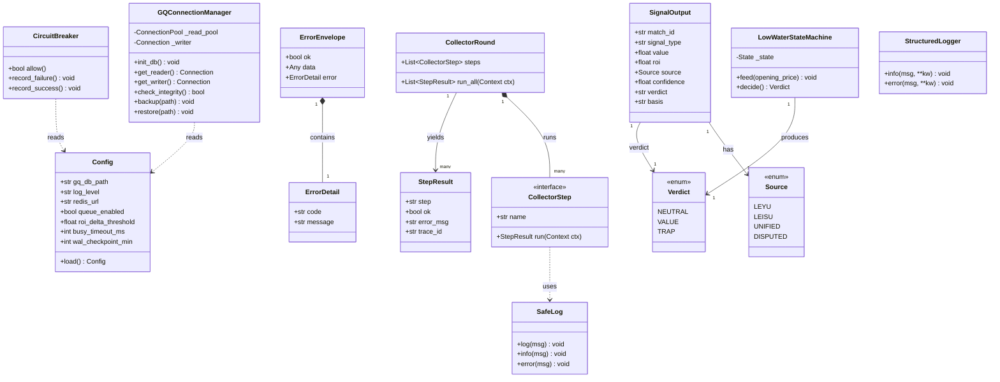
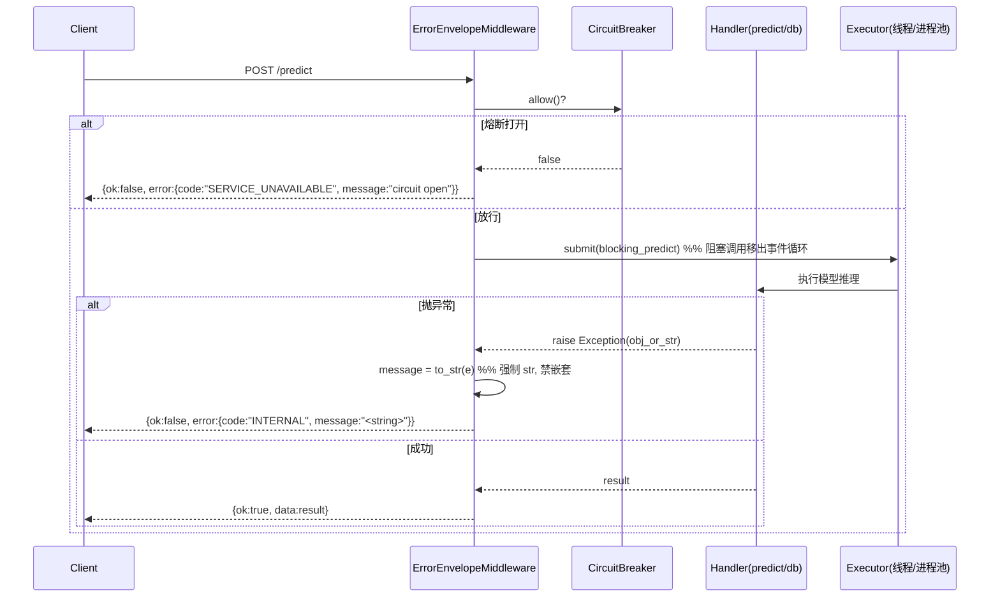
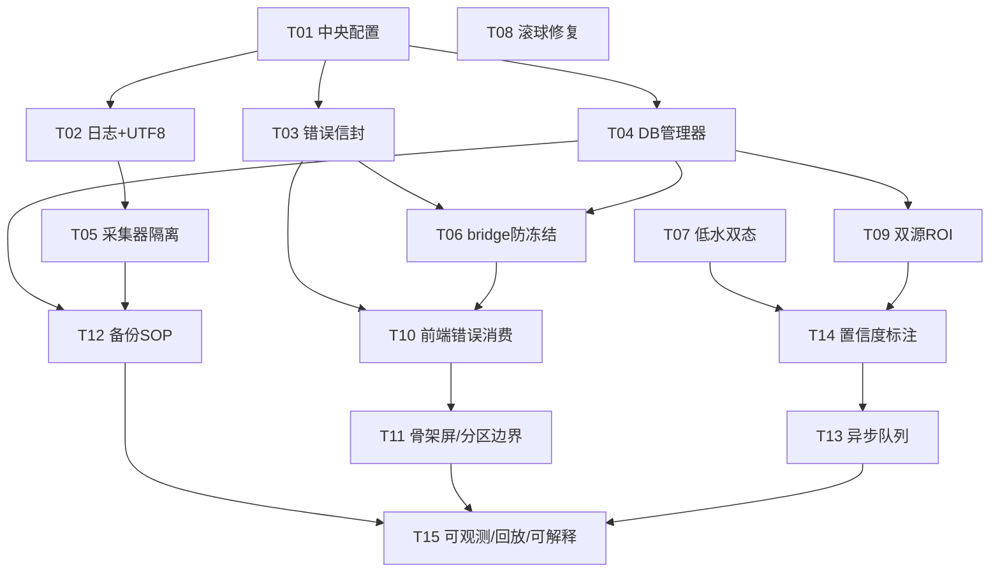

# 哨响AI 稳定化下一代足球系统 — 系统架构设计 + 任务分解

> 文档类型：Architecture Design + Task Breakdown（可直接交付工程师实现）
> 作者：高见远（Gao，架构师）
> 输入：PRD v0.1（许清楚）
> 版本：v0.1（待涛哥评审 TBC-1~5）
> 范围：复用现有盘口 SSoT / ML 模型 / 数据资产，**非推倒重来**；在架构层根治 7 类事故

---

## 0. 设计总览（一页纸）

| 事故 | 根因（架构层） | 根治模式 | 对应 REQ | 主要改造文件 |
|---|---|---|---|---|
| ① bridge 冻结 | 阻塞调用在事件循环内；`/health` 与主业务共用循环；下游挂起拖死全站 | 阻塞调用移出事件循环 + `/health` 独立 + 熔断 | REQ-01,11 | `bridge_service.py`, `core/health.py`, `core/circuit_breaker.py` |
| ② GQ 坏页 | `conn()` 每次连接抢持久化 PRAGMA 写锁 → database locked → 未捕获崩溃 → 坏页 | WAL+单写者+连接池+坏页自检（PRAGMA 仅初始化一次） | REQ-02,12 | `gq/db.py`, `core/db_manager.py` |
| ③ 前端白屏 | 后端 `error.message` 是对象 → `setError(obj)` → React 抛错 | 统一错误信封 `{ok,error:{code,message:string}}` + 前端安全消费 | REQ-03,04,14 | `core/error_envelope.py`, `frontend/src/api/*`, `ErrorBoundary` |
| ④ 非 ASCII 崩轮 | Windows GBK stdout；中文/emoji `print` → UnicodeEncodeError → 整轮崩溃跳过 live 翻页 | UTF-8 日志适配层 + `SafeLog` 转义 | REQ-05,06,10 | `core/safe_log.py`, `gq/auto_collector.py` |
| ⑤ 低水自相矛盾 | 无开盘价截图的 live 场景直接判"诱多" | 双态状态机（无开盘价=中性/待确认） | REQ-07,13,17 | `pipeline/operator_signals.py` |
| ⑥ 滚球时间窗口 | 6 层叠加 bug（死变量/λ 分流/分钟污染/方向/键名/kickoff 闸门） | 逐层修复 + 单测 | REQ-08 | `analysis/live_goal_probe.py` |
| ⑦ 双源 ROI 偏差 | 7360 脏行 + 采样偏差无护栏 | 脏数据清洗 + 写入校验 + 双源对齐/置信区间 | REQ-09,13 | `pipeline/compute_value_layer.py`, `scripts/clean_unified_history.py` |

**架构模式总括**：分层（api / service / data）+ 统一异常中间件（错误信封）+ 熔断器 + 单写者 DB 连接管理器 + 采集器 per-step 隔离运行器 + 低水双态状态机 + 结构化 JSON 日志（trace_id）。

---

## 1. 实现方案 + 框架选型

### 1.1 七类事故架构级根治方案

#### 事故① bridge_service 事件循环防冻结（REQ-01 + REQ-11）
- **根因定位**（已读 `bridge_service.py`）：FastAPI 应用在同一 uvicorn worker 内既跑 `/health` 又跑 `/predict`；`/predict` 内的模型推理、`gq.db` 分析缓存、`analysis_center` 扫描等**阻塞/同步调用直接跑在 asyncio 事件循环上**；一旦下游（GQ.db 锁、分析中心扫描）挂起，事件循环被占满 → `/health` 也超时 → CLOSE_WAIT 累积 → 全站超时。
- **根治方案**：
  1. **阻塞调用移出事件循环**：`/predict` 的模型推理改走 `asyncio.run_in_executor(ThreadPoolExecutor/ProcessPoolExecutor, blocking_predict)`，事件循环始终空闲。
  2. **`/health` 独立路径**：新增 `core/health.py`，提供**不带任何 DB/模型依赖**的纯存活检查（仅返回 200 + 进程元数据）。强烈建议**独立端口/独立 uvicorn worker**（如 `:9001` 轻量 health server），与主 `:9000` 业务进程解耦，确保主进程冻结时 health 仍 200。
  3. **熔断**：对下游（GQ.db 分析缓存、analysis_center）加 `CircuitBreaker`（`core/circuit_breaker.py`），下游异常/超时时快速失败，绝不阻塞事件循环。
  4. **CLOSE_WAIT 治理**：所有 IO 设超时（httpx/client timeout、sqlite `busy_timeout`）；`finally` 中关闭连接；shutdown 钩子清理 executor。
  5. **停机铁律（已知坑）**：`bridge_service` 通过 `.venv` shim 垫片 re-dispatch 到系统 Python312 worker，**停服须 shim + worker 全杀**（仅杀 worker 会留 shim 空转持锁）。在 `scripts/` 提供 `stop_bridge.sh/.bat` 双杀脚本。

#### 事故② GQ.db 连接治理（REQ-02 + REQ-12）
- **根因定位**（已读 `gq/db.py`）：`conn()` 每次连接执行 `PRAGMA journal_mode=WAL` / `PRAGMA synchronous=NORMAL`（持久化设置，存文件头），强制抢写锁 → 全量轮持锁时其他 `conn()` 在 PRAGMA 上 busy 超时（实测 1244 次 `database locked`）→ 未捕获路径崩溃 → 坏页。
- **现状**：2026-08-18 已做部分修复——PRAGMA 移至一次性 `_ensure_pragmas()`（进程启动调用一次）。**剩余缺口**：无连接池、无单写者约束、无坏页自检、无备份恢复 SOP。
- **根治方案**：
  1. **PRAGMA 仅初始化一次**（幂等），后续连接自动继承 WAL（已完成，固化）。
  2. **单写者（Single-Writer）**：所有写操作经唯一 writer 连接（或 writer 队列串行化），杜绝并发写抢锁；读走独立 reader 连接 / WAL 多读。
  3. **连接池**：`core/db_manager.py` 提供有界连接池（基于 `sqlite3` 自建轻量池或 `SQLAlchemy.QueuePool`），checkout 时健康检查。
  4. **坏页自检**：启动 + 周期执行 `PRAGMA integrity_check` / `PRAGMA foreign_key_check`；发现损坏 → 自动从最近快照恢复（REQ-12）。
  5. **WAL checkpoint + 备份 SOP**（`scripts/backup_gq.py`）：定时快照 + `WAL checkpoint`；演练坏页自动恢复。

#### 事故③ 前端白屏（REQ-03 + REQ-04 + REQ-14）
- **根因**：后端异常时返回 `{error:{code, message}}` 但 `message` 是**对象/嵌套结构** → 前端 `setError(object)` 塞入 state → render 抛错 → 白屏。
- **根治方案**：
  1. **REQ-03 统一错误信封中间件**（`core/error_envelope.py`）：捕获所有未处理异常，序列化为 `{ok:false, error:{code:str, message:str}}`；`message` **强制 str**（对对象型异常做 `str()`/JSON 序列化转字符串，绝不透传对象）。用 Pydantic `response_model` 强约束 schema。
  2. **REQ-04 前端安全消费**：`frontend/src/api/client.ts` 单一客户端，将任意 error  coerce 为安全字符串；`setError` 类型限定为 `string`；全局 `ErrorBoundary`（`frontend/src/components/ErrorBoundary.tsx`）+ 友好提示组件兜底。
  3. **REQ-14 骨架屏 + 分区错误边界**：LiveScores / 信号页弱网加载有骨架；单板块失败仅该区提示，不拖垮整页。

#### 事故④ 采集器非 ASCII 崩轮（REQ-05 + REQ-06 + REQ-10）
- **根因**：Windows 默认 stdout 编码 GBK；采集器 `print`/log 含中文/emoji → `UnicodeEncodeError` 未捕获 → 整轮崩溃 → 提前 `return` 跳过 live 翻页 → `scheduled` 永不翻 live。
- **根治方案**：
  1. **REQ-05 UTF-8 日志适配层**（`core/safe_log.py` + `core/logging_config.py`）：入口 `sys.stdout.reconfigure(encoding='utf-8')`、`PYTHONUTF8=1`/`PYTHONIOENCODING=utf-8`；`SafeLog` 包装所有 print/log，编码异常时 `backslashreplace` 转义非 ASCII，绝不抛出。
  2. **REQ-06 per-step 隔离**（`core/collector_step.py`）：`CollectorRound` 将每轮关键步骤（fetch / parse / persist / live-flip）包进 `try/except`；单步失败仅记录 `StepResult(ok=false, error_msg:str)` 并**继续后续步骤**，绝不提前 `return`；每步带 `trace_id`。

#### 事故⑤ 低水规则自相矛盾（REQ-07 + REQ-13 + REQ-17）
- **根因**：live 场景无开盘价截图时，低水线被直接判"诱多"，无依据打脸（如特尔纳瓦 2-2）。
- **根治方案**：
  1. **双态状态机**（`LowWaterStateMachine` in `pipeline/operator_signals.py`）：`NEED_OPENING`（开盘价缺失）→ 判定固定为 `NEUTRAL/待确认`，**禁止输出诱多**；`HAVE_OPENING` → 跑完整陷阱/价值逻辑。
  2. **REQ-13 来源+置信度**：信号输出带 `source` + `confidence`；无开盘价 → `confidence` 低、标注"依据不足"。
  3. **REQ-17 可解释视图**（P2）：前端可展开"开盘价 vs 即时价曲线"查看判定依据。

#### 事故⑥ 滚球破蛋神器 6 层时间窗口 bug（REQ-08）
- **根因**（已读 `analysis/live_goal_probe.py`）：6 层叠加缺陷——① 死变量接入；② λ 口径分流（双 λ 自相矛盾）；③ feed minute 污染未去；④ 方向校正缺失（活盘低水=赔付管理≠概率终点）；⑤ 键名对齐错误；⑥ kickoff 闸门缺失。
- **根治方案**：6 项独立修复，每项配单测（见 §4 时序图③ + 任务 T08）。

#### 事故⑦ 双源 ROI 19pp 偏差 + 7360 脏行（REQ-09 + REQ-13）
- **根因**：`unified_history.db` 7360 脏行污染；双源采样偏差无护栏。
- **根治方案**：
  1. **脏数据清洗**（`scripts/clean_unified_history.py`）：幂等清洗 7360 脏行；**写入时校验护栏**（schema/一致性检查失败即拒写）。
  2. **双源 ROI 对齐**：同 `match+market+timestamp` 对齐样本，算置信区间；`|ΔROI| > 阈值`（TBC-3，默认 <5pp）标注 `source=DISPUTED/已知采样差异`。
  3. **REQ-13**：每个信号/ROI 带 `source` + `confidence`。

### 1.2 架构模式与框架选型

| 关注点 | 选型 | 理由 |
|---|---|---|
| Web 框架 | FastAPI + uvicorn（保留） | 现状即 FastAPI，最小改动 |
| 阻塞调用隔离 | `asyncio.run_in_executor` + `ThreadPoolExecutor`/`ProcessPoolExecutor` | 把模型推理移出事件循环 |
| 健康检查隔离 | 独立轻量 health server（`:9001`）或独立 worker | 主进程冻结时 health 仍 200 |
| 熔断 | `pybreaker`（或自建 `CircuitBreaker`） | 下游异常快速失败 |
| SQLite 池/单写者 | 自建 `core/db_manager.py`（`sqlite3` + 轻量池 + 单 writer） | 避免 ORM 开销，精确控制 WAL/锁 |
| 异步 DB 读 | `aiosqlite`（可选，读路径） | 保持事件循环不被读阻塞 |
| 结构化日志 | `python-json-logger` / `structlog` | JSON + trace_id 可检索 |
| 配置 | `pydantic-settings`（`core/config.py`） | 单一 env 驱动配置源 |
| 异步队列（TBC-5） | **ARQ + Redis**（首选）；无 Redis 则进程内 asyncio worker 兜底 | asyncio 原生，运维轻；见 §6 |
| 前端错误 | `react-error-boundary` + 自建 `SafeError` | 成熟 ErrorBoundary |
| 前端栈 | Vite + React + MUI + Tailwind（保留） | PRD 默认 |

### 1.3 TBC-1~5 推荐默认值（工程师可按此推进，标注待涛哥确认）

- **TBC-1（bridge 重构边界）**：**推荐默认 = 防冻结改造，保留职责，不彻底重写**。`predict()` 逻辑、shim re-dispatch 架构保留；仅做"阻塞调用移出循环 + health 独立 + 熔断"。理由：PRD 明确"复用资产非推倒重来"，彻底重写风险/工期不可控。*待涛哥确认是否接受改造范围。*
- **TBC-2（SQLite 规模上限）**：**推荐默认 = 本期仅保稳定**（WAL+单写者+池+坏页自检+备份 SOP），GQ.db ~7GB 单机 WAL 可支撑；**分库/归档留待下一代 P1+**（REQ-12 先建备份+归档脚本雏形）。*待确认是否本期就需要分库。*
- **TBC-3（双源 ROI 偏差阈值）**：**推荐默认 = 清洗+护栏，目标双源 ROI 偏差 `<5pp`；超阈值标注 `source=DISPUTED/已知采样差异` 作为合规口径**。理由：19pp 系脏数据+采样偏差，清洗后应显著收敛；<5pp 与 PRD 暗示一致。*待操盘手确认业务可接受阈值。*
- **TBC-4（前端错误信封契约改造面）**：**推荐默认 = 全量契约改造为统一 `{ok:false, error:{code, message:string}}` + 单一 `api/client.ts` 包裹所有消费点**；先做"消费点清单 grep 审计"（`frontend/src/api`、`services`、`store` 全部收口到 client）。*待确认第三方组件（如 MUI/图表）适配面，必要时加适配层。*
- **TBC-5（异步队列选型）**：**推荐默认 = ARQ + Redis**（asyncio 原生、与 FastAPI 事件循环天然集成、运维轻于 Celery）；**若运行环境无私 Redis，则用进程内 `asyncio.Queue` + worker 任务兜底**（单机私有部署够用）。*待确认是否引入 Redis。*

---

## 2. 文件列表及相对路径

> 根目录 = `D:\Architecture`（运行主场）。标注：`[改]`=改造既有文件，`[新]`=新增。
> 铁律：盘口 SSoT = `pipeline/opening_line.py.build_opening_lines()`；OU/AH 回测走 `pipeline/clean_outcomes.py.load_clean_outcomes()` + `build_opening_lines()`，**禁直读 `match_outcomes` 盘口列**。

```
D:\Architecture
├── core/                              # [新] 跨切面基础设施（所有模块共享）
│   ├── config.py                      # [新] 中央配置(pydantic-settings): gq_db_path/log_level/redis_url/queue_enabled/roi_delta_threshold/busy_timeout_ms
│   ├── logging_config.py              # [新] JSON 结构化日志 + trace_id (REQ-10)
│   ├── safe_log.py                    # [新] UTF-8 安全日志适配层/SafeLog (REQ-05)
│   ├── error_envelope.py              # [新] 错误信封 schema + 统一异常中间件 (REQ-03)
│   ├── db_manager.py                  # [新] SQLite 连接管理器: WAL+单写者+池+integrity_check (REQ-02)
│   ├── collector_step.py              # [新] 采集器 per-step 隔离运行器 CollectorRound/CollectorStep (REQ-06)
│   ├── circuit_breaker.py             # [新] 熔断器 CircuitBreaker (REQ-01)
│   └── health.py                      # [新] 独立 health 端点(无 DB/模型依赖) (REQ-01)
├── gq/
│   ├── db.py                          # [改] 落实单写者/池/自愈(复用 core/db_manager) (REQ-02)
│   ├── auto_collector.py              # [改] 接入 SafeLog + CollectorRound per-step 隔离 (REQ-05,06)
│   └── ... (保留 analysis_cache 等)
├── pipeline/
│   ├── opening_line.py                # [保] SSoT 盘口线(不改, 仅引用)
│   ├── clean_outcomes.py              # [保] 干净赛果(不改, 仅引用)
│   ├── compute_value_layer.py         # [改] ROI 信号附 source+confidence + 脏行写入护栏 (REQ-09,13)
│   └── operator_signals.py            # [改] 低水双态状态机 + 来源标注 (REQ-07,13,17)
├── analysis/
│   ├── live_goal_probe.py             # [改] 滚球破蛋神器 6 层修复 (REQ-08)
│   └── backtest_live_goal_probe.py    # [改] 6 项单测/回测
├── bridge_service.py                  # [改] 阻塞调用移出循环 + 接入 health/熔断/error_envelope (REQ-01,03)
├── scripts/
│   ├── clean_unified_history.py       # [新] 清洗 7360 脏行 + 写入校验护栏 (REQ-09)
│   ├── backup_gq.py                   # [新] GQ.db 备份/坏页恢复 SOP (REQ-12)
│   └── stop_bridge.sh/.bat            # [新] shim+worker 双杀停机脚本
├── api/                               # [新] 统一 API 层(可选, 若从 bridge_service 拆出)
│   ├── main.py
│   ├── middleware/error_envelope.py
│   └── routers/...
├── frontend/src/
│   ├── api/
│   │   ├── client.ts                  # [改] 单一 API 客户端, 错误 coerce 为 string (REQ-03,04)
│   │   └── envelope.ts                # [新] 错误信封类型 + 解析
│   ├── components/
│   │   ├── ErrorBoundary.tsx          # [新] 全局错误边界 (REQ-04)
│   │   ├── SafeError.tsx               # [新] 友好错误提示
│   │   └── Skeleton/                  # [新] 骨架屏 (REQ-14)
│   ├── pages/
│   │   ├── LiveScores/                # [改] live 标识 + 分区边界 + 骨架 (REQ-04,06,14)
│   │   ├── MatchAnalysis/DiagPanel.tsx# [改] 低水双态中性展示 + 可解释曲线 (REQ-07,17)
│   │   ├── Trading/ValuePanel.tsx     # [改] source+confidence 排序 (REQ-09,13)
│   │   └── LiveGoalProbe/             # [改] 时间窗口/λ 口径一致展示 (REQ-08)
│   ├── store/  types/                 # [改] 错误类型安全化 (REQ-04)
│   └── ...
├── tests/
│   ├── test_error_envelope.py         # REQ-03 回归(对象型 message→string)
│   ├── test_frontend_white_screen.py  # REQ-04 回归(对象 error 不白屏)
│   ├── test_collector_isolation.py    # REQ-06 单步失败不跳步
│   ├── test_gq_no_lock.py             # REQ-02 无 database locked
│   ├── test_live_goal_probe_6layers.py# REQ-08 六层逐项单测
│   ├── test_low_water_state.py        # REQ-07 无开盘价不判诱多
│   └── test_dual_source_roi.py        # REQ-09 双源偏差收敛
└── docs/
    ├── system_design.md               # 本文件
    ├── class-diagram.mermaid
    └── sequence-diagram.mermaid
```

---

## 3. 数据结构和接口（类图 / 接口契约）

### 3.1 类图（Mermaid，另存 `docs/class-diagram.mermaid`）



### 3.2 关键接口契约

**(a) 错误信封 schema（REQ-03，强制）**
```python
class ErrorDetail(BaseModel):
    code: str            # 机器可读错误码, 如 "SERVICE_UNAVAILABLE"/"INTERNAL"
    message: str         # 强制字符串! 对象/嵌套结构必须 str() 后填入, 禁透传

class ErrorEnvelope(BaseModel):
    ok: Literal[False] = False
    error: ErrorDetail

class SuccessEnvelope(BaseModel):
    ok: Literal[True] = True
    data: Any
```
> 中间件保证：任何未捕获异常 → `ErrorEnvelope(error=ErrorDetail(code=..., message=str(e)))`。`message` 绝不可能是 dict/list。

**(b) 配置项（`core/config.py`，pydantic-settings）**
| 字段 | 类型 | 默认 | 说明 |
|---|---|---|---|
| `gq_db_path` | str | `./GQ.db` | GQ.db 路径 |
| `log_level` | str | `INFO` | 日志级别 |
| `redis_url` | str\|None | `None` | 异步队列(ARQ)；None=进程内兜底 |
| `queue_enabled` | bool | `False` | 是否启用异步队列(REQ-11) |
| `roi_delta_threshold` | float | `5.0` | 双源 ROI 偏差告警阈值(pp)，TBC-3 |
| `busy_timeout_ms` | int | `30000` | sqlite busy_timeout |
| `wal_checkpoint_min` | int | `15` | WAL checkpoint 周期(分钟) |

**(c) DB 连接管理类（`core/db_manager.py`）**
```python
class GQConnectionManager:
    def init_db(self) -> None: ...            # 一次性 PRAGMA(WAL+synchronous=NORMAL), 幂等
    def get_reader(self) -> sqlite3.Connection: ...   # 从读池取(自动继承 WAL)
    def get_writer(self) -> sqlite3.Connection: ...   # 唯一 writer 连接(单写者)
    def check_integrity(self) -> bool: ...    # PRAGMA integrity_check / foreign_key_check
    def backup(self, path: str) -> None: ...  # 快照 + WAL checkpoint
    def restore(self, path: str) -> None: ... # 从快照恢复(坏页自愈)
```

**(d) 采集器 step 接口（REQ-06）**
```python
class CollectorStep(ABC):
    name: str
    @abstractmethod
    def run(self, ctx: CollectorContext) -> StepResult: ...

@dataclass
class StepResult:
    step: str
    ok: bool
    error_msg: str        # 安全字符串, 非对象
    trace_id: str

class CollectorRound:
    def __init__(self, steps: List[CollectorStep]): ...
    def run_all(self, ctx) -> List[StepResult]:
        # 每步 try/except; 失败仅记录 StepResult(ok=False), 继续后续步骤, 绝不 return
```

**(e) 信号输出结构（含 source/confidence，REQ-13）**
```python
class SignalOutput(BaseModel):
    match_id: str
    signal_type: str          # e.g. "cross_book_edge" / "soft_line_value"
    value: float
    roi: float
    source: Source            # LEYU / LEISU / UNIFIED / DISPUTED
    confidence: float         # 0..1
    verdict: str              # NEUTRAL / VALUE / TRAP
    basis: str                # 判定依据文本(如"开盘价 0.95 → 即时 0.80")
```

**(f) 低水双态状态机（REQ-07）**
```python
class LowWaterStateMachine:
    def feed(self, opening_price: float | None) -> None:
        self._state = NEED_OPENING if opening_price is None else HAVE_OPENING
    def decide(self) -> Verdict:
        # NEED_OPENING -> 永远返回 NEUTRAL(待确认), 禁 TRAP
        # HAVE_OPENING -> 走完整陷阱/价值逻辑
```

---

## 4. 程序调用流程（时序图，另存 `docs/sequence-diagram.mermaid`）

### 4.1 ① 采集 → 入库 → API → 前端 全链路（体现 per-step 隔离）

```mermaid
sequenceDiagram
    participant C as CollectorRound
    participant S1 as Step:Fetch
    participant S2 as Step:Parse
    participant S3 as Step:Persist(live-flip)
    participant DB as GQConnectionManager
    participant API as FastAPI+ErrorEnvelope
    participant FE as Frontend(api client)
    participant EB as ErrorBoundary

    C->>S1: run(ctx) [try/except per step]
    S1-->>C: StepResult(ok=true)
    C->>S2: run(ctx)
    S2-->>C: StepResult(ok=true)
    C->>S3: run(ctx)
    S3->>DB: get_writer().execute(INSERT live)
    DB-->>S3: ok
    S3-->>C: StepResult(ok=true)  %% live-flip 完成, 未跳过
    Note over C: 任一步失败仅记 StepResult(ok=false), 不 return, 后续步骤照常执行

    FE->>API: GET /api/matches/live
    API->>DB: get_reader().execute(SELECT)
    DB-->>API: rows
    API-->>FE: {ok:true, data:[...]}
    FE->>FE: render LiveScores (live 标识, 不漏显)
    Note over FE,EB: 异常时中间件返回 {ok:false,error:{code,message:str}};<br/>api client 转安全 string; ErrorBoundary 兜底, 永不白屏
```

### 4.2 ② 一次 API 请求经统一异常中间件的错误处理流（REQ-03）



### 4.3 ③ 滚球破蛋神器时间窗口 / λ 口径正确流程（REQ-08，6 层修复）

```mermaid
sequenceDiagram
    participant Feed as 分钟级 feed 事件
    participant KG as KickoffGate
    participant CM as CleanMinute
    participant LW as LambdaEngine
    participant DC as DirectionCorrector
    participant OUT as SignalOutput

    Feed->>KG: on_minute_event(minute, prices)
    KG->>KG: 是否已开赛? (opened_at 已 set)
    alt 未开赛
        KG-->>OUT: 跳过(不输出破蛋信号)
    else 已开赛
        KG->>CM: clean(event)
        CM->>CM: 去污染: 过滤非比赛时钟/补时异常分钟(修复③)
        CM->>LW: compute_lambda(cleaned_minute)
        LW->>LW: λ 单一口径(修复②, 不再双λ分流); 用 OU 诚实锚去水概率(修复①死变量)
        LW->>DC: raw_direction
        DC->>DC: 方向校正(修复④: 活盘低水=赔付管理≠概率终点; 键名对齐修复⑤)
        DC->>OUT: verdict + basis
        OUT->>OUT: 附 source + confidence (REQ-13)
    end
    Note over Feed,OUT: 6层修复: ①死变量移除 ②λ单口径 ③分钟去污染 ④方向校正 ⑤键名对齐 ⑥kickoff闸门
```

---

## 5. 任务列表（有序、含依赖、验收点、对应 REQ）

> **说明**：按团队主理人要求，**枚举全部 P0 需求级任务**（REQ-01~09 全覆盖）+ P1 主干。同时为工程师给出 **5 个宏观实施阶段（Phase 0~4）** 作为实现顺序。任务数超过通用 5 任务上限，系主理人显式要求 P0 全覆盖所致；依赖图见 §9。

### 宏观实施阶段（实现顺序）
- **Phase 0 基础设施/跨切面**：T01~T04（config / 日志 / 错误信封 / DB 管理器）— 其余全部依赖
- **Phase 1 bridge & API 稳定**：T06（REQ-01）、T03（REQ-03，已在 P0）
- **Phase 2 DB & 采集器稳定**：T04/T05/T12（REQ-02/05/06/12）
- **Phase 3 规则引擎正确性**：T07/T08/T09/T14（REQ-07/08/09/13）
- **Phase 4 前端稳定 & 可观测**：T10/T11/T13/T15（REQ-04/14/11 + P2）

### 详细任务表

| 编号 | 标题 | 涉及文件 | 依赖 | 验收点 | REQ |
|---|---|---|---|---|---|
| **T01** | 中央配置模块 | `core/config.py` | — | `Config.load()` 单例；env 可覆盖；被 T02~T04 引用 | 基础 |
| **T02** | 结构化日志 + UTF-8 安全日志 | `core/logging_config.py`, `core/safe_log.py` | T01 | 注入中文/emoji 日志压测，整轮不崩、不提前 return；输出 JSON 含 trace_id | REQ-05,10 |
| **T03** | 统一错误信封中间件 | `core/error_envelope.py` | T01 | 所有异常分支单测覆盖；`message` 强约束 str；对象型异常→字符串 | REQ-03 |
| **T04** | SQLite 连接管理器（WAL+单写者+池+自检） | `core/db_manager.py`, `gq/db.py`[改] | T01 | 24h 高频写无 `database locked`；启动 integrity_check；PRAGMA 仅初始化一次 | REQ-02 |
| **T05** | 采集器单轮隔离 + UTF-8 接入 | `core/collector_step.py`, `gq/auto_collector.py`[改] | T02,T04 | 模拟某步抛错，后续 live 翻页/入库仍执行；前端"刚开赛不显示"消失 | REQ-05,06 |
| **T06** | bridge 防冻结 + health 独立 + 熔断 | `bridge_service.py`[改], `core/health.py`, `core/circuit_breaker.py` | T03,T04 | 10× 压测 `/health` 持续 200 且 P99<1s；CLOSE_WAIT 不累积；停服 shim+worker 双杀脚本可用 | REQ-01 |
| **T07** | 低水双态判定状态机 | `pipeline/operator_signals.py`[改] | T01 | 特尔纳瓦类样本无开盘价时不输出诱多；有开盘价才给方向 | REQ-07,13 |
| **T08** | 滚球破蛋神器 6 层修复 | `analysis/live_goal_probe.py`[改], `backtest_live_goal_probe.py`[改] | T01 | 6 项独立单测逐项通过；输出口径文档 | REQ-08 |
| **T09** | 双源 ROI 治理 + 脏数据清洗 | `pipeline/compute_value_layer.py`[改], `scripts/clean_unified_history.py`[新] | T04 | 7360 脏行清零且写入校验拦截；双源 ROI 偏差收敛至 <阈值(TBC-3) | REQ-09,13 |
| **T10** | 前端错误安全消费 | `frontend/src/api/client.ts`[改], `envelope.ts`[新], `ErrorBoundary.tsx`[新], `SafeError.tsx`[新] | T03 | 构造后端对象型 error 回归测试，前端不抛错、显示友好提示；白屏率=0 | REQ-04 |
| **T11** | 前端骨架屏 + 分区错误边界 | `frontend/src/components/Skeleton/*`[新], `pages/LiveScores/*`[改] | T10 | LiveScores/信号页弱网有骨架；单板块失败仅该区提示 | REQ-14 |
| **T12** | SQLite 备份/恢复 SOP | `scripts/backup_gq.py`[新] | T04,T05 | 定时快照 + WAL checkpoint；坏页自动从备份恢复演练通过 | REQ-12 |
| **T13** | 异步任务队列集成 | `core/` 队列适配 + `bridge_service.py`[改] | T01,T12 | 采集/推理入队，主 API 不被长任务阻塞；队列积压可观测 | REQ-11 |
| **T14** | 信号置信度/来源标注落库与 API | `pipeline/*`[改], `api/` 或 `bridge_service.py`[改] | T07,T09 | 价值信号/ROI 均带 source+confidence；前端可区分双源分歧 | REQ-13 |
| **T15** | 可观测面板 + 事故回放 + 可解释视图（P2） | `Ops` 页 + `tests/` 故障注入 + `DiagPanel`[改] | T06,T11,T14 | 7 指标趋势面板；nightly 注入 7 类故障零复现；开盘价 vs 即时价曲线可展开 | REQ-15,16,17 |

---

## 6. 依赖包列表

### 后端（新增 / 升级）
```
fastapi>=0.110           # 保留, Web 框架
uvicorn[standard]>=0.29  # 保留, ASGI server(独立 health worker)
pydantic>=2.6            # 保留, 信封/信号 schema
pydantic-settings>=2.2   # [新] 中央配置 core/config.py
python-json-logger>=2.0  # [新] JSON 结构化日志 (REQ-10)
# 或 structlog>=24  (二选一)
aiosqlite>=0.19          # [新, 可选] 异步读路径, 保持事件循环不被读阻塞
pybreaker>=1.0           # [新] 熔断器 (REQ-01) 或自建 core/circuit_breaker.py
arq>=0.26 + redis>=5.0   # [新, TBC-5] 异步任务队列首选(无 Redis 则进程内 asyncio 兜底)
prometheus-client>=0.20  # [新, P2] 可观测指标 (REQ-15)
```

### 前端（新增 / 升级）
```
react>=18                 # 保留
vite>=5                   # 保留
@mui/material>=5           # 保留
tailwindcss>=3            # 保留
react-error-boundary>=4.0 # [新] 成熟 ErrorBoundary (REQ-04)
# 可选: zod>=3 用于前端信封校验
```

### TBC-5 异步队列选型回应
- **首选 ARQ + Redis**：asyncio 原生，与 FastAPI 事件循环天然集成，无 Celery 的 prefork/线程与 asyncio 冲突问题，运维最轻。
- **兜底**：若运行环境无私 Redis，用进程内 `asyncio.Queue` + worker 协程（单机私有部署足够），接口与 ARQ 一致便于后续切换。
- *待涛哥确认是否引入 Redis。*

---

## 7. 共享知识（跨文件约定）

- **日志格式**：统一 JSON（`{"ts","level","logger","trace_id","msg",...}`），UTF-8；入口强制 `PYTHONUTF8=1` / `PYTHONIOENCODING=utf-8` / `sys.stdout.reconfigure(encoding='utf-8')`。所有 print/log 经 `SafeLog`，非 ASCII 自动 `backslashreplace` 转义，**绝不抛出 UnicodeEncodeError**。
- **错误信封契约**：`{ok:bool, data?, error?:{code:str, message:str}}`。**`message` 永远是字符串**，对象/嵌套结构必须 `str()`/JSON 序列化后填入。前端 `setError` 仅接收 `string`。
- **配置管理**：唯一来源 `core/config.py`（pydantic-settings，env 驱动）。禁止散落常量；新增开关/阈值走 Config。
- **DB 连接约定**：WAL + `synchronous=NORMAL` 在 `init_db()` **仅执行一次**（幂等）；`busy_timeout=30s`；写走**唯一 writer**（单写者）；读走连接池；启动 + 周期 `PRAGMA integrity_check`；**禁止在 `conn()` 每次连接执行持久化 PRAGMA**（坏页根因）。
- **编码约定**：全栈 UTF-8；采集器/模型输出统一 `str` 化后再入 state/日志。
- **盘口铁律（禁项）**：
  - 禁直读 `match_outcomes` 盘口列 → 走 `pipeline/opening_line.py.build_opening_lines()`（SSoT=抽水最低线）。
  - OU/AH 训练回测必须 `pipeline/clean_outcomes.py.load_clean_outcomes()` + `build_opening_lines()`。
  - 抗诱导特征**禁用原始赔率值**作特征，只用三类不变量：去水概率 / 漂移 / 跨市场残差。
  - CS 波胆=诱导层（最便宜命中率 9.4%，真实比分 91.2% 被开出）；OU 是诚实锚。
- **采集器禁项**：禁 per-round 早 `return` 跳步；每步必须 `try/except` 且失败仅记 `StepResult(ok=false)` 后继续。
- **前端禁项**：禁 `setError` 接收对象；禁把后端响应原样塞 state；板块级错误用分区 `ErrorBoundary` 兜底。

---

## 8. 待明确事项（TBC-1~5，供主理人转交涛哥确认）

| TBC | 架构影响 | 推荐默认值 | 待确认方 |
|---|---|---|---|
| **TBC-1** bridge 重构边界 | 决定 REQ-01 工期与文件改造面；彻底重写需新建 api/ 包并迁移 predict 逻辑 | **防冻结改造，保留职责，不彻底重写** | 涛哥 |
| **TBC-2** SQLite 规模上限 | 决定 REQ-02/12 是否需分库/归档；影响 `core/db_manager.py` 设计 | **本期仅保稳定（WAL+单写者+池+自检+备份 SOP）；分库/归档留下一代 P1+** | 涛哥 |
| **TBC-3** 双源 ROI 偏差阈值 | 决定 `roi_delta_threshold` 默认值与 `source=DISPUTED` 触发线 | **清洗+护栏，目标 `<5pp`；超阈值标注 `DISPUTED/已知采样差异`** | 操盘手 |
| **TBC-4** 前端错误信封契约改造面 | 决定 `frontend/src` 改造范围；第三方组件可能需适配层 | **全量契约改造 + 单一 `api/client.ts` 收口；先做消费点 grep 审计** | 涛哥/前端 |
| **TBC-5** 异步队列选型 | 决定 REQ-11 依赖（是否引入 Redis）与 `core/` 队列适配接口 | **ARQ + Redis（首选）；无 Redis 则进程内 asyncio worker 兜底** | 涛哥 |

> 工程师可按上述"推荐默认值"立即推进，所有 TBC 项已在代码中以 Config 字段/常量形式预留，待确认后仅改配置即可，无需返工。

---

## 9. 任务依赖图（Mermaid）


